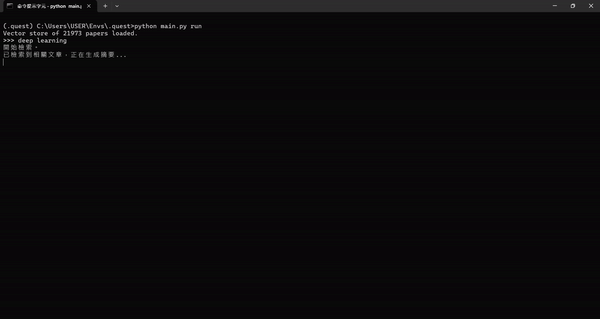

## 論文推薦機器人: LLM練習作品 Paper Suggestion Robot
1. 利用Langchain建構RAG模型，從OpenAlex論文庫中搜尋出與使用者輸入最相關的文章並予以介紹，大幅減少人力搜尋參考資料所需時間。
2. 設計few-shot prompt以加強回答精準度及一致性。
3. 以Llama3 TAIDE模型建立文本生成鏈。
4. 利用Chroma vector store儲存數萬篇論文的標題與摘要資訊。
###
1. Constructed a RAG (Retrieval-Augmented Generation) model via Langchain that retrieves and briefs papers relevant to the input from OpenAlex database, significantly reducing the time spent on reference material searching.
2. Designed few-shot prompts to enhance response accuracy and consistency.
3. Used Llama3 TAIDE model as the text generation chain.
4. Used Chroma vector store to store the titles and abstracts of papers as as the retriever.
## 成果展示 Demo

## 環境 Environment
* Python 3.12.4
* `pip install -r requirements.txt`
## 模型 Model
使用LlamaCpp架設LLM backend，本專案使用 `Llama3-TAIDE-LX-8B-Chat-Alpha1-4bit` 模型，建議至少要有16GB以上的GPU記憶體。 Constructed LLM backend via LlamaCpp, and used `Llama3-TAIDE-LX-8B-Chat-Alpha1-4bit` as the model. To run this, 16 GB or more GPU memory could provide smoother performance.
## 用法 Directions
1. 可視需求建立虛擬環境，參考上面指令，利用 `requirements.txt` 文件安裝模組。
2. 執行主程式：  `python main.py run`。 初次執行會花費較多時間下載LLM模型包，根據網路速度不同，需要約略數十分鐘進行下載，完成後即可開始輸入指令。
3. 可視需求微調 `main.py` 中的篩選標準，重新下載新的論文資訊以取代舊有 `db`，但此動作根據資料量及電腦效能，會花費數小時時間作儲存。
### 
1. You may set up a virtual environment if needed. Refer to the command above and install necessary modules via `requirements.txt`.
2. Run the program: `python main.py run`. It will take longer for the first time as LLM model needs to be downloaded. Depending on the internet, this process may take several minutes. Once complete, you can start inputting commands.
3.  You can adjust the parameters in `main.py` and re-download the paper information, replacing the original db folder. However, this process can take hours depending on the data size and computer performance.
## 授權 Autorization
MIT License
